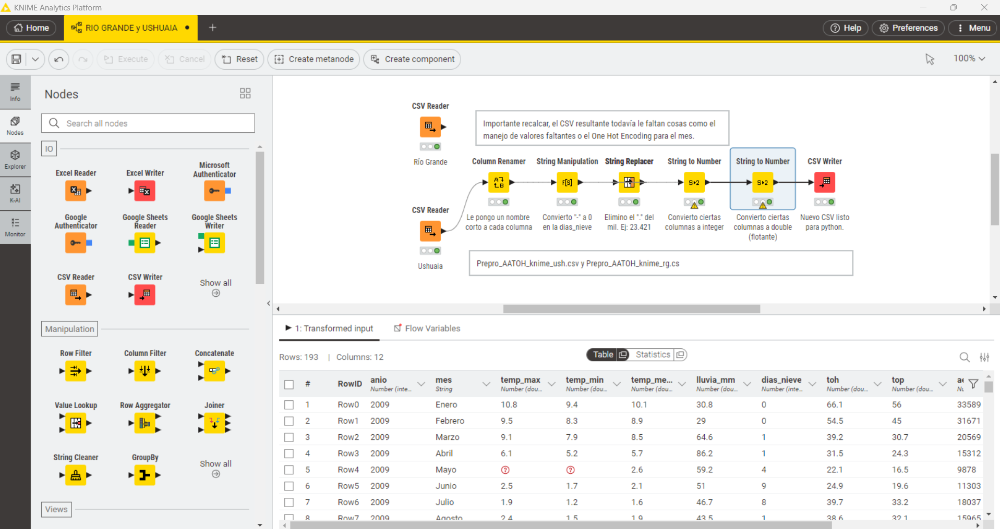

# Descripción de la Carpeta `raw`

La carpeta `raw` es una parte fundamental de nuestro proyecto de Aprendizaje Automático: "Predicción de la Tasa de Ocupación Hotelera y de Plazas en Tierra del Fuego". Este directorio contiene los archivos de datos originales y los resultados de las primeras etapas de unificación y preprocesamiento, sirviendo como la base para el modelado predictivo. Buscamos proporcionar una comprensión exhaustiva de los datos, su origen y las transformaciones realizadas para prepararlos para el modelado predictivo.                                   

## Origen y Adquisición del Dataset

Los datos provienen del Instituto Provincial de Estadística y Censos (IPIEC) de Tierra del Fuego, una fuente pública y oficial que garantiza la fiabilidad de la información. Se extrajeron datos de las siguientes secciones y URLs:

* **Meteorología**:
    * **Fuente**: `https://ipiec.tierradelfuego.gob.ar/estadisticas-del-medio-ambiente/`
    * **Archivo Original**: `22_2_01_Meteorologia_Temperatura_Precipitaciones.xlsx`
    * **Variables Extraídas (mensuales)**: Temperatura máxima promedio, Temperatura media promedio, Temperatura mínima promedio, Lluvia en mililitros, Días de nieve.

* **Turismo**:
    * **Fuente**: `https://ipiec.tierradelfuego.gob.ar/estadisticas-economicas-2/`
    * **Archivo Original**: `16_3_01_Habitaciones_plazas_tasas_ocupacion-1.xlsx`
    * **Variables Extraídas (mensuales)**: TOH% (Tasa de Ocupación Hotelera) y TOP% (Tasa de Ocupación de Plazas).

* **Transporte Aéreo**:
    * **Fuente**: `https://ipiec.tierradelfuego.gob.ar/estadisticas-economicas-2/`
    * **Archivo Original**: `14_5_03_Transporte_aereo._Movimiento_de_pasajeros_por_aeropuerto (1).xlsx`
    * **Variables Extraídas (mensuales)**: Personas desembarcadas en el aeropuerto de Río Grande (RG) y personas desembarcadas en el aeropuerto de Ushuaia (USH).

* **Transporte Terrestre**:
    * **Fuente**: `https://ipiec.tierradelfuego.gob.ar/estadisticas-economicas-2/`
    * **Archivo Original**: `14_5_04_Transporte_terrestre_Ingreso_Egreso_personas_por_San_Sebastian (1).xlsx`
    * **Variables Extraídas (mensuales)**: Personas entradas por San Sebastián.

Todos los archivos originales contenían información de mes y año, lo que facilitó su integración temporal.

### Proceso de Recopilación y Unificación

La unificación de estos cuatro datasets originales en una única tabla se realizó manualmente en un archivo Excel, denominado `Columnas_unificadasUSHyRG.xlsx`. Este proceso fue necesario debido a que los datos no se ofrecían en un formato CSV estándar, sino como informes estructurados con títulos y aclaraciones, lo que impedía una concatenación directa.

Posteriormente, este archivo Excel se dividió en dos hojas, las cuales fueron guardadas individualmente como archivos CSV para facilitar su manejo en KNIME:

* `Columnas_unificadasUSH.csv`
* `Columnas_unificadasRG.csv`

El resultado de esta unificación fue una tabla inicial de 12 características para 170 instancias.

## Preprocesamiento de Datos para Aprendizaje Automático

El preprocesamiento es una etapa crucial en el Aprendizaje Automático para asegurar la calidad y el formato adecuado de los datos para el entrenamiento de modelos.

### Preprocesamiento Inicial con KNIME

Se utilizó KNIME para una fase inicial de limpieza y preparación de los datos. Las tareas principales incluyeron:

* **Renombrado de Columnas**: Se estandarizaron los nombres de las características para facilitar su manejo.
* **Conversión de Tipos de Datos**: Se aseguró que cada columna tuviera el tipo de dato correcto (ej., numérico para temperaturas y conteos).

Los archivos resultantes de esta etapa son:

* `Prepro_AATOH_knime_rg.csv`
* `Prepro_AATOH_knime_ush.csv`

### Procesamiento Avanzado con Python (Google Colab)

La fase más intensiva de preprocesamiento se llevó a cabo en un entorno de Python (Google Colab), enfocándose en la imputación de valores ausentes y la codificación de variables categóricas.

El *notebook* de Python utilizado es: `Prepro_predHOT.ipynb`

* **Imputación de Variables**: La imputación es vital para manejar datos faltantes y evitar la pérdida de instancias valiosas, permitiendo que los algoritmos de Aprendizaje Automático trabajen con un conjunto de datos completo.
    * **Tasas de Ocupación (TOH% / TOP%)**:
        * **Problema**: Se identificó una ausencia completa de datos para los años 2009-2010 en estas variables.
        * **Solución**: Para imputar estos valores, se utilizó la **mediana mensual** calculada a partir del período 2011-2022.
        * **Justificación**: Esta estrategia se eligió debido a los fuertes patrones estacionales presentes en el turismo (ej., temporada alta en verano, baja en invierno), asegurando que los valores imputados reflejen el comportamiento típico de cada mes.
    * **Entradas por San Sebastián**:
        * **Problema**: Se observaron valores ausentes para Río Grande (RG), mientras que los datos para Ushuaia (USH) estaban presentes.
        * **Solución**: Se empleó un modelo de **Random Forest** para imputar estos valores.
        * **Justificación**: Random Forest es un algoritmo de Aprendizaje Automático robusto que puede manejar relaciones no lineales entre variables, lo que lo hace adecuado para predecir valores faltantes basándose en otras características del dataset.

* **One-Hot Encoding**:
    * **Variable 'Mes'**: La característica 'Mes' (mes del año), que inicialmente era una cadena de texto (ej., "Enero", "Febrero"), fue transformada utilizando **One-Hot Encoding**.
    * **Resultado**: Esta técnica convierte una variable categórica en múltiples columnas binarias (0 o 1), una por cada categoría única. Esto es fundamental para que los algoritmos de Aprendizaje Automático, que generalmente operan con datos numéricos, puedan procesar esta información sin asumir una relación ordinal incorrecta entre los meses.

## Conclusión

Tras estas etapas de adquisición y preprocesamiento, los datasets de Río Grande y de Ushuaia están ahora completos y en el formato adecuado, con 23 características, listos para ser utilizados en el entrenamiento y evaluación de modelos de Aprendizaje Automático para el proyecto. Estan presentes dentro de `data/processed/`.

